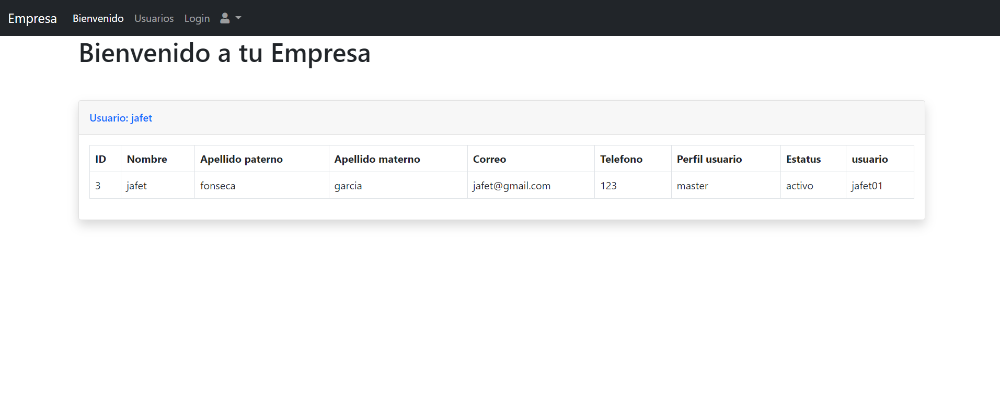
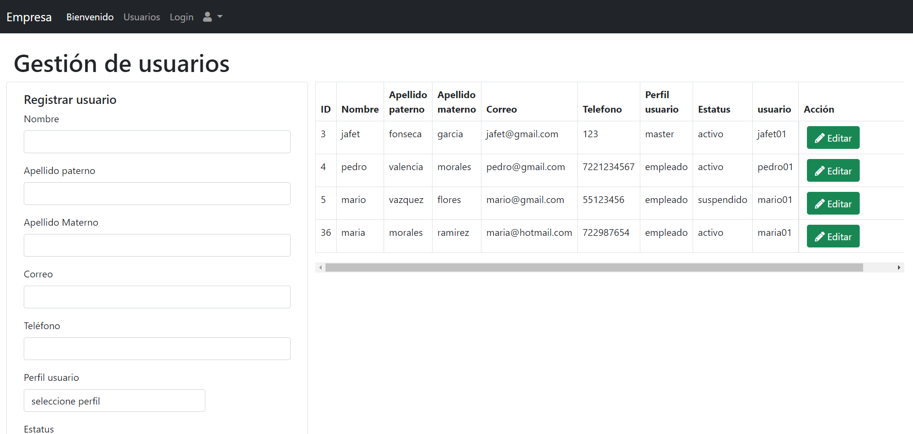
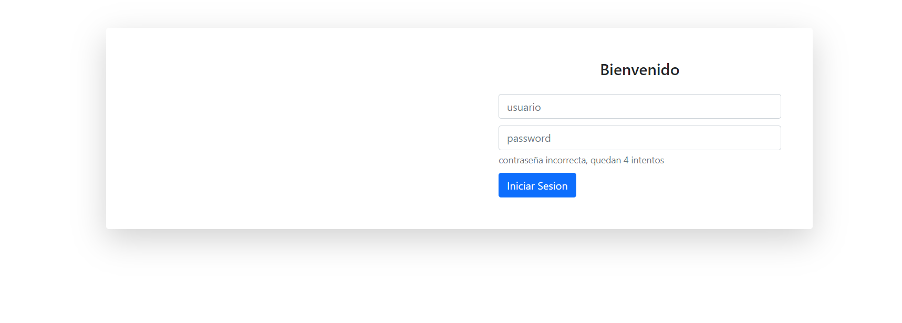
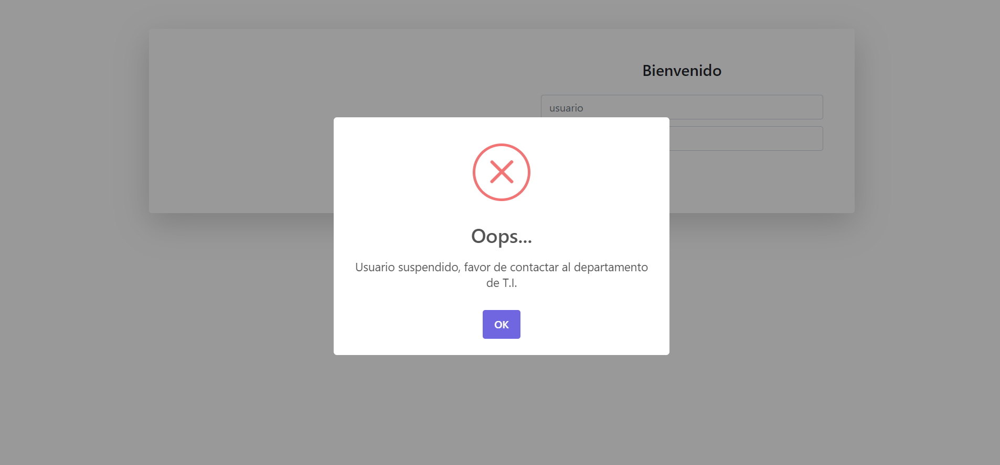
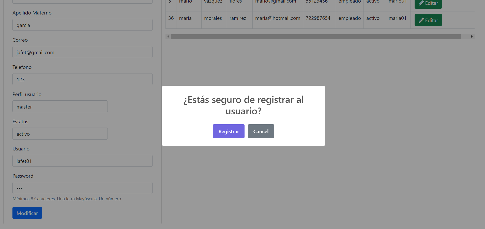
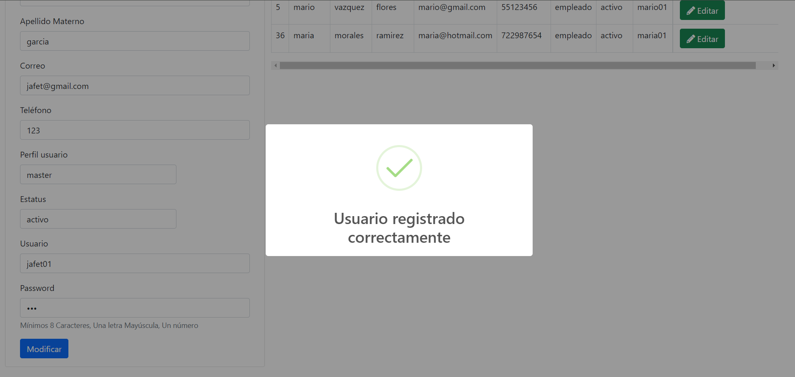

# sistemaEmpresa-jstl-sweetalert
Sistema web en java usando jstl, sweetalert, javaScript, jspf, servlets, jsp, jpa, Bootstrap

•   Crear el proyecto en NetBeans, Java web, Web Application con el nombre “Empresa” que debe de contener los siguientes archivos:

o   Login.jsp 
<ul>
    <li>Validación de acceso</li>
    <li>Más de 5 intentos se suspende el usuario, mostrando el mensaje: Usuario suspendido, favor de contactar al departamento de T.I.</li>
</ul>

o   AltaModificaUsuario.jsp

-Formulario de alta
<ul>
    <li>Nombre</li>
    <li>Apellido Paterno</li>
    <li>Apellido Materno</li>
    <li>Correo</li>
    <li>Teléfono</li>
    <li>Perfil usuario
        <ul>
            <li>Master</li>
            <li>Empleado</li>
        </ul>
    </li>
    <li>Estatus
        <ul>
            <li>(A) Activo.</li>
            <li>(S) Suspendido.</li>
        </ul>
    </li>
    <li>Usuario</li>
    <li>Password
        <ul>
            <li>Mínimos 8 Caracteres</li>
            <li>Una letra Mayúscula</li>
            <li>Un número</li>
        </ul>
        </li>
</ul>

- Deberá de validar los campos:
  <ul>
      <li>Si existe algún campo vació mostrar mensaje que faltan datos por ingresar.</li>
      <li>Si No existe campos vacíos Mostrar mensaje, estás seguro de registrar al usuario, deberá de contener dos botones:
          <ul>
              <li>Cancelar
                 <ul><li>Cierra el mensaje.</li></ul>
             </li>
              <li>Registrar
                  <ul><li>Deberá de registrar a la base de datos y mostrando el mensaje Usuario registrado correctamente.</li></ul>
              </li>
          </ul>
      </li>
      <li>En el mismo archivo se deberá de mostrar en una tabla con Bootstrap los usuarios creados, con los datos del formulario de Alta.</li>
      <li>Modificación de usuario, deberá de contener los mismos datos de alta y características.</li>
  </ul>

o   Bienvenido.jsp  
    -   Deberá de mostrar el texto “Bienvenido a tu empresa”, mostrando los datos del usuario ingresado en una tabla con Bootstrap.

o   MenuOpciones.jspf  
    -   Deberán de contener los archivos jsp

•   Crear base de datos en MySQL que se llame “Empresa” que debe de incluir las siguientes tablas:  
    o   Usuario  
    o   Acceso  
    o   PerfilUsuario  
        -   Master  
        -   Empleado  
    o   Estatus  
        -   Activo  
        -   Suspendido  

o   Todas las tablas deberán estar relacionadas.

o   Características de los Usuario  
    -   Master deberá poder:  
        •   Ingresar desde el archivo Login.jsp  
        •   MenuOpciones.jspf  
            -   Tener acceso a todos los archivos creados.  
            -   Podrá Crear y Modificar a los usuarios Empleados.   
    -   Empleado   
        •   Deberá ingresar desde el archivo Login.jsp  
        •   MenuOpciones.jspf  
            -   Tener acceso al archivo de Bienvenido.jsp  

•   Deberán usar:  
o   IDE Desarrollo NetBeans  
o   Bootstrap  
o   Sweetalert (Para todos los mensajes).  
o   JavaScript  
o   Servlet  
o   Java Interface  
o   Implements de Java Interface  

